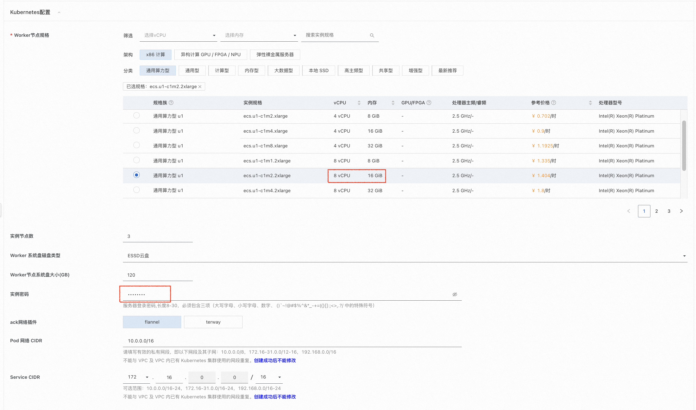
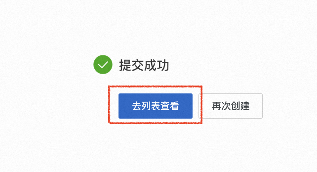
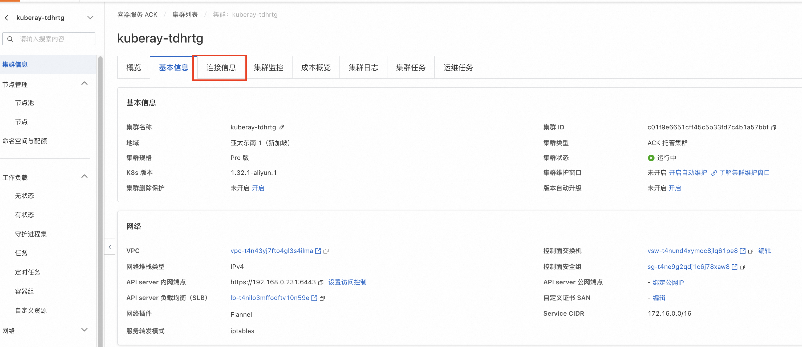

<h1> Rapid deployment of the Ray computing nest </h1>

<h2> Overview </h2>

Ray is an open-source platform that supports model training, testing, and deployment, developed by RISELab at the University of California, Berkeley. It is designed to simplify the development and deployment of large-scale machine learning, reinforcement learning, and distributed computing tasks.
Ray is designed to provide high performance, flexibility, and ease of use, enabling developers to easily build and scale complex distributed applications. Whether you're processing massive amounts of data, training deep learning models, or running reinforcement learning algorithms, Ray provides powerful support. 

<h2> Prerequisites </h2>

 To deploy a Ray Community Edition service instance, you need to access and create some Alibaba Cloud resources. Therefore, your account must contain permissions for the following resources.
<strong> Note </strong>: This permission is required only when your account is a RAM account. 

<table>
<thead>
<tr>
<th> Permission policy name </th>
<th> Remarks </th>
</tr>
</thead>
<tbody>
<tr>
<td>AliyunCSFullAccess</td>
<td> Manage permissions for Container Service (CS) </td>
</tr>
<tr>
<td>AliyunECSFullAccess</td>
<td> Permissions to manage ECS </td>
</tr>
<tr>
<td>AliyunVPCFullAccess</td>
<td> Permissions for managing VPC networks </td>
</tr>
<tr>
<td>AliyunROSFullAccess</td>
<td> Manage permissions for Resource Orchestration Services (ROS) </td>
</tr>
<tr>
<td>AliyunComputeNestUserFullAccess</td>
<td> Manage user-side permissions for the compute nest service (ComputeNest) </td>
</tr>
</tbody>
</table>

<h2> Billing instructions </h2>

 the cost of ray community edition deployment in computing nest mainly involves:

<ul>
<li> vCPU and memory specifications of the selected Worker node </li>
<li> System disk type and capacity </li>
<li> Internet bandwidth </li>
</ul>

<h2> Deployment process </h2>

<ol>
<li> Click the <a href = "https://computenest.console.aliyun.com/service/instance/create/cn-hangzhou?type=user&ServiceName=Ray社区版">Ray one-click deployment </a> link,
Go to the Create Ray Cluster page. If there is no Aliyun account, you need to register your account first. </li>
<li> When creating a Ray cluster, first select Create ACK Cluster. The service instance name will be used as the namespace of the running Ray platform and will be used when the model service is deployed.
</li>
<li> To ensure the smooth operation of Ray, we recommend that you select a specification of 8vCpu 16GiB or more for the worker node. Then fill in the instance password.

Model deployment basically requires Gpu. If you need Gpu, select the specification with Gpu in this step.
The next section of this document demonstrates how to deploy the Stable Diffusion model service on a Ray cluster. recommend using the ecs.gn7i-c8g1.2xlarge and later specifications, the system disk size of the worker node recommend greater than 1024GB.
</li>
<li> Select any Availability Zone and click Next: Confirm Order.
</li>
<li> Confirm that the dependency permission is authorized. If not, click Authorize. Then click Create Now
</li>
<li> Click to go to list view
</li>
<li> After jumping to the service instance interface of the computing nest console, please wait for the creation of the Ray cluster to be completed, which takes about 10 minutes.
</li>
<li> After creating the Ray cluster, click the Ray cluster name to go to the Ray cluster details page.
</li>
<li> click the revealed web url to access the Ray Dashboard of the Ray cluster. At this point, the Ray cluster is running successfully, and you can learn how to deploy your own model in the cluster in the next section: Quickly experience model deployment.

</li>
</ol>

<h2> Experience model service deployment </h2>

 After creating a Ray cluster through Alibaba Cloud, this section shows how to deploy a text-to-image generation service based on the Stable Diffusion on the Ray cluster. More examples can be found in [http://docs.ray.io/en/master/cluster/kubernetes/examples/stable-diffusion-rayservice.html#kuberay-stable-diffusion-rayservice-example). 

<h3> Confirm that the cluster configuration is sufficient </h3>

<blockquote>

<strong>⚠️ Note:</strong> If the cluster configuration is not enough, it will cause the stable Diffusion model service deployment to fail.
1. Deploy the Stable Diffusion model service on the Ray cluster, recommend use the ecs.gn7i-c8g1.2xlarge and later specifications, and the system disk size of the worker node recommend 1024GB or more. The official configuration requirements are shown in the figure below.

</blockquote>

<h3> Bind a public IP address to the cluster (skip if bound)</h3>

<blockquote>

<strong>⚠Note:</strong> If the public network IP is not bound, the Ray cluster will fail to pull the model file and the Ray cluster will not be able to provide external services.
1. On the Service Instance Details page, click Resources to view the resource usage of the Ray cluster.

2. Find the k8s cluster and click the name to enter the k8s cluster details page.

3. Click Bind Public IP and select an existing EIP. If there is no EIP, click Create EIP. After the EIP is created, return to the page to bind the public IP.

<h3> Connect to the Kubernetes cluster through the kubectl </h3>
</blockquote>

<ol>
<li> On the Service Instance Details page, click Resources to view the resource usage of the Ray cluster.
</li>
<li> Find the k8s cluster and click the name to enter the k8s cluster details page.

</li>
<li> Click Connection Info to view the kubeconfig file.
</li>
<li> Click <a href = "https://kubernetes.io/docs/tasks/tools/?spm = 5176.28197681.0.0.5 f425ff66rLatZ"> Install and set up kubectl</a>. This is a tool for managing k8s clusters with local devices. The corresponding installation method can be selected according to its own operating system.

</li>
<li> Run the following command on the local device or manually create the $HOME/.kube/config file in the directory path, and paste the contents of the kubeconfig file into the file.
'''bash
sudo mkdir -p $HOME/.kube
sudo touch $HOME/.kube/config
sudo chmod 777 $HOME/.kube/config
vim $HOME/.kube/config</li>
</ol>

<h3> Deploy model services </h3>

<ol>
<li>
 After pasting the contents of the kubeconfig file into the file, execute the following command on the local device. -- namespace ={$ service instance name}. Replace with the name of the Ray cluster.
For example, the name of the author's Ray cluster is kuberay-tdhrtg, so the following instruction is replaced by sudo kubectl config set-context-current-namespace = kuberay-tdhrtg

<pre><code> sudo kubectl config set-context --current -- namespace={$Ray cluster name }

2.  Run the following commands locally. Corresponds to the section following [Ray Official Tutorial ](https://docs.ray.io/en/master/cluster/kubernetes/examples/stable-diffusion-rayservice.html) from Step 3.
 '''bash
 kubectl apply -f https://raw.githubusercontent.com/ray-project/kuberay/master/ray-operator/config/samples/ray-service.stable-diffusion.yaml
 kubectl get pods
 # Wait until the stable-diffusion is 'Running'. About 15 minutes are required for this to complete.
 kubectl describe rayservices.ray.io stable-diffusion
 # Forward the port of Serve
 kubectl port-forward svc/stable-diffusion-serve-svc 8000

 # Download 'stable_diffusion_req.py'
 curl -LO https://raw.githubusercontent.com/ray-project/serve_config_examples/master/stable_diffusion/stable_diffusion_req.py

 # Set your 'prompt' in 'stable_diffusion_req.py'.

 # Send a request to the Stable Diffusion model.
 python stable_diffusion_req.py
</code></pre>

kubectl apply deploy Stable Diffusion takes about 15 minutes.

</li>
<li>
 After running python stable<em>diffusion</em>req.py, the model will output an image named output.png. At this point, the Stable Diffusion model service deployment is complete.

</li>
<li>
output.png as shown below.

</li>
</ol>

<h2> More information </h2>

<ol>
<li><a href = "https://www.ray.io/">Ray </a></li>
<li><a href = "https://github.com/ray-project/ray">Ray standalone open source library </a></li>
<li><a href = "https://github.com/ray-project/kuberay">Ray Cluster Edition Open Source Library </a></li>
<li><a href = "https://docs.ray.io/en/latest/ray-overview/getting-started.html">Ray QuickStart help documentation </a></li>
<li><a href = "https://docs.ray.io/en/latest/ray-overview/examples.html">Ray Model Servicing Sample Document </a></li>
</ol>
