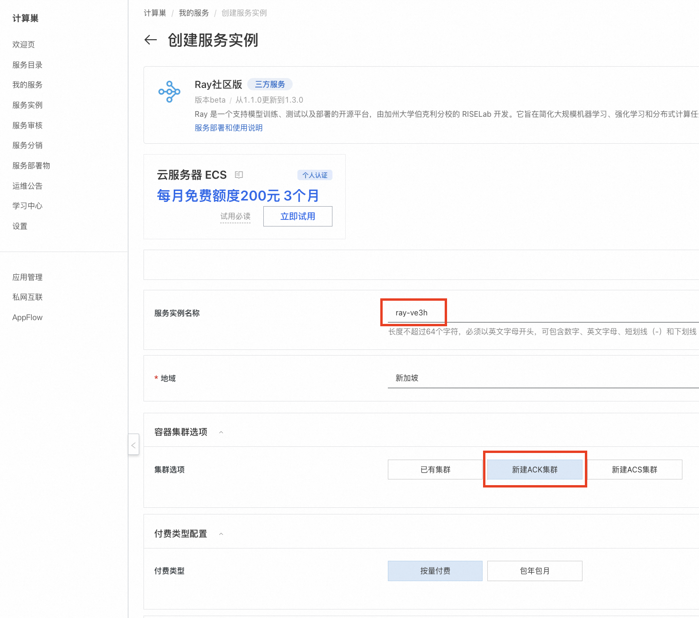

# 15分钟拉起Ray集群并部署Stable Diffusion模型服务

## Ray 平台简介

**[Ray](https://www.ray.io/)** 是一个支持模型训练、测试以及部署的开源平台，由加州大学伯克利分校的 RISELab 开发。它旨在简化大规模机器学习、强化学习和分布式计算任务的开发与部署。Ray 的设计目标是提供高性能、灵活性和易用性，使开发者能够轻松构建和扩展复杂的分布式应用程序。无论是处理海量数据、训练深度学习模型，还是运行强化学习算法，Ray 都能提供强大的支持。


Ray提供了大量的[帮助文档](https://docs.ray.io/en/latest/ray-overview/getting-started.html)，其中包含许多示例和教程，帮助用户快速掌握如何通过Ray进行模型训练、测试和部署。


还提供了大量适用于生产环境中的[模型服务化的例子](https://docs.ray.io/en/latest/ray-overview/examples.html)，涉及大语言模型，强化学习，机器学习模型, 图像生成（Stable Diffusion），图像分类，文本分类和目标检测等众多领域和方向， 帮助模型开发者能够快速通过Ray构建和部署模型服务。


---

## Ray 的核心能力

### 1. 分布式计算
- **分布式训练**：Ray 提供了分布式训练的能力，支持多机多卡的模型训练，显著缩短训练时间。
- **并行任务执行**：Ray 支持将任务分解为多个子任务，并在分布式环境中并行执行，从而高效处理大规模数据和计算密集型任务。
- **动态任务调度**：Ray 提供了一个灵活的任务调度器，可以根据资源需求动态分配计算资源，优化任务执行效率。
- **容错机制**：内置的容错机制能够在节点故障时自动恢复任务，确保系统的高可用性。

### 2. 模型训练和测试
- **支持主流机器学习框架**：Ray 可以与 TensorFlow、PyTorch 等主流机器学习框架无缝集成，加速模型训练和推理。
- **支持强化学习**：Ray 集成了 RLlib，这是一个强大的强化学习库，支持多种算法（如 DQN、PPO、A3C 等），适用于各种强化学习场景。
- **高效仿真环境**：Ray 可以与仿真环境（如 OpenAI Gym）结合，快速构建和测试强化学习模型。
- **超参数调优**：通过 Ray Tune（Ray 的超参数优化库），用户可以高效地进行超参数搜索，找到最优模型配置。

### 3. 服务编排与部署
- **Ray Serve**：Ray 提供了一个轻量级的服务编排框架（Ray Serve），用于部署和管理机器学习模型和服务。它支持多模型组合、动态扩展和低延迟推理。
- **实时推理**：Ray Serve 能够处理高并发的实时推理请求，适合生产环境中的模型服务化。

### 4. 大规模数据处理
- **Ray Data**：Ray 提供了一个分布式数据处理库（Ray Data），用于高效处理大规模数据集。它支持常见的数据操作（如过滤、映射、聚合等），并能与其他 Ray 组件无缝集成。
- **与大数据生态兼容**：Ray 可以与 Apache Spark 等大数据工具结合使用，进一步扩展其数据处理能力。

---

## Ray 的部署方式

通过以上介绍可以看出，Ray 是一个功能强大且灵活的分布式计算平台，适用于从机器学习到科学计算的广泛场景。它的高性能、易用性和丰富的生态系统使其成为开发者的首选工具之一。

那么，该如何部署和使用 Ray 呢？

### 本地单机部署
Ray支持在不同操作系统下的[本地部署](https://docs.ray.io/en/latest/ray-overview/installation.html)，且提供了python、Java、C++以及Docker等情况下的安装方式。

### 本地集群部署

>**前提条件：** 用户已有k8s集群或可自行创建k8s集群。

由于单机场景下性能有限，难以支持生产场景下的模型训练，Ray还提供了开源的集群版本：[KubeRay](https://github.com/ray-project/kuberay)。

用户可根据[RayCluster Quickstart](https://docs.ray.io/en/master/cluster/kubernetes/getting-started/raycluster-quick-start.html)流程部署KubeRay，
可根据[RayJob Quickstart](https://docs.ray.io/en/master/cluster/kubernetes/getting-started/rayjob-quick-start.html)体验如何通过KubeRay管理任务，
还可根据[RayService Quickstart](https://docs.ray.io/en/master/cluster/kubernetes/getting-started/rayservice-quick-start.html)体验如何通过KubeRay部署用户应用。
仓库中还提供了一些生产环境中的示例应用，帮助用户快速了解KubeRay下的模型部署过程。


### 阿里云一键部署

>**前提条件：** 开通阿里云账号。

阿里云计算巢提供了Ray的一键部署服务，用户无需手动搭建Ray集群，仅需在创建实例后等待约10分钟，即可体验Ray集群的强大能力。

#### 部署流程
1. 点击[Ray一键部署](https://computenest.console.aliyun.com/service/instance/create/cn-hangzhou?type=user&ServiceName=Ray%E7%A4%BE%E5%8C%BA%E7%89%88)链接，
   进入创建Ray集群的页面。如没有阿里云账号需要先注册账号哦。
2. 创建Ray集群时，首先选择新建ACK集群。服务实例名称将作为运行Ray平台的命名空间，将在模型服务部署时使用。
   
3. 为保障Ray的流畅运行，Worker节点建议选择 8vCpu 16GiB 以上的规格。然后填写实例密码。
   
   模型部署基本都有Gpu需求，如果需要Gpu，请在此步选择有Gpu的规格。
   本文档在下一节演示了如何在Ray集群上部署Stable Diffusion模型服务，推荐使用ecs.gn7i-c8g1.2xlarge及以上规格，worker节点系统盘大小推荐1024GB以上。
   
4. 选择任意一个可用区，然后点击 下一步：确认订单。
   
5. 确认依赖权限已授权，如未授权，请点击授权。然后点击 立即创建
   
6. 点击 去列表查看
   
7. 跳转到计算巢控制台的服务实例界面后，请等待Ray集群创建完成，大约需要10分钟。
   
8. 创建Ray集群完成后，点击 Ray集群名称进入Ray集群详情页面。
   
9. 点击透出的web url，即可访问到Ray集群的Ray Dashboard。此时Ray集群已经成功运行，可通过 下一节：快速体验模型部署 了解如何在集群内部署自己的模型。
   
   

#### 体验模型服务部署
通过阿里云创建Ray集群后，本节展示如何在Ray集群上部署一个基于 Stable Diffusion 的文本到图像生成服务。更多示例可参考[http://docs.ray.io/en/master/cluster/kubernetes/examples/stable-diffusion-rayservice.html#kuberay-stable-diffusion-rayservice-example)。

##### 确认集群配置足够
>**⚠️注意：** 如果集群配置不够用，会导致Stable Diffusion模型服务部署失败。
1. 在Ray集群上部署Stable Diffusion模型服务，推荐使用ecs.gn7i-c8g1.2xlarge及以上规格，worker节点系统盘大小推荐1024GB以上。
   

##### 集群绑定公网IP(如果已绑定可跳过)
>**⚠️注意：** 如果不绑定公网IP，会导致Ray集群拉取模型文件失败，也会导致Ray集群无法提供对外服务。
1. 在服务实例详情页面，点击 资源 ，查看Ray集群的资源使用情况。
   
2. 找到k8s集群，点击名称进入k8s集群详情页面。
   
   
3. 点击 绑定公网IP ，选择已有EIP。如果没有EIP，点击创建EIP，创建完成后，返回该页面绑定公网IP。
   
   
##### 通过 kubectl 连接 Kubernetes 集群
1. 在服务实例详情页面，点击 资源 ，查看Ray集群的资源使用情况。
   
2. 找到k8s集群，点击名称进入k8s集群详情页面。
   
   
3. 点击连接信息，查看kubeconfig文件。
   
4. 点击 [安装和设置 kubectl](https://kubernetes.io/docs/tasks/tools/?spm=5176.28197681.0.0.5f425ff66rLatZ) 。这是一个用本地设备管理k8s集群的工具。可根据自身操作系统选择对应的安装方式。
   
   
5. 在本地设备上执行以下命令或自行在目录路径下手动创建$HOME/.kube/config文件，并将kubeconfig文件内容粘贴到该文件中。
    ```bash
   sudo mkdir -p $HOME/.kube
   sudo touch $HOME/.kube/config
   sudo chmod 777 $HOME/.kube/config
   vim $HOME/.kube/config
##### 部署模型服务
1. 将kubeconfig文件内容粘贴到该文件中后，在本地设备上执行以下命令。--namespace={$服务实例名称}，需要替换为Ray集群名称。
   如笔者的Ray集群名称为kuberay-tdhrtg，因此下面的指令替换为sudo kubectl config set-context --current --namespace=kuberay-tdhrtg
   ```bash
   sudo kubectl config set-context --current --namespace={$Ray集群名称}

2. 在本地依次执行以下命令。对应[Ray官方教程](https://docs.ray.io/en/master/cluster/kubernetes/examples/stable-diffusion-rayservice.html)从Step 3之后的部分。
   ```bash
   kubectl apply -f https://raw.githubusercontent.com/ray-project/kuberay/master/ray-operator/config/samples/ray-service.stable-diffusion.yaml
   kubectl get pods
   # Wait until the RayService `Ready` condition is `True`. This means the RayService is ready to serve.
   kubectl describe rayservices.ray.io stable-diffusion
   # Forward the port of Serve
   kubectl port-forward svc/stable-diffusion-serve-svc 8000
   
   # Download `stable_diffusion_req.py`
   curl -LO https://raw.githubusercontent.com/ray-project/serve_config_examples/master/stable_diffusion/stable_diffusion_req.py
   
   # Set your `prompt` in `stable_diffusion_req.py`.

   # Send a request to the Stable Diffusion model.
   python stable_diffusion_req.py
3. 运行python stable_diffusion_req.py后，模型会输出一张名为output.png的图片。此时，Stable Diffusion模型服务部署完成。
   

4. output.png如下图所示。
   

---

## 更多信息
1. [Ray官网](https://www.ray.io/)
2. [Ray单机版开源库](https://github.com/ray-project/ray)
3. [Ray集群版开源库](https://github.com/ray-project/kuberay)
4. [Ray QuickStart帮助文档](https://docs.ray.io/en/latest/ray-overview/getting-started.html)
5. [Ray 模型服务化示例文档](https://docs.ray.io/en/latest/ray-overview/examples.html)