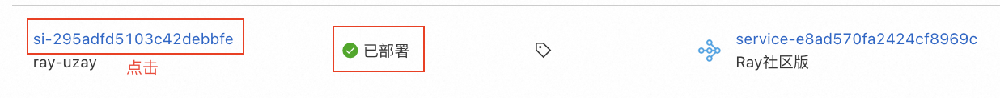
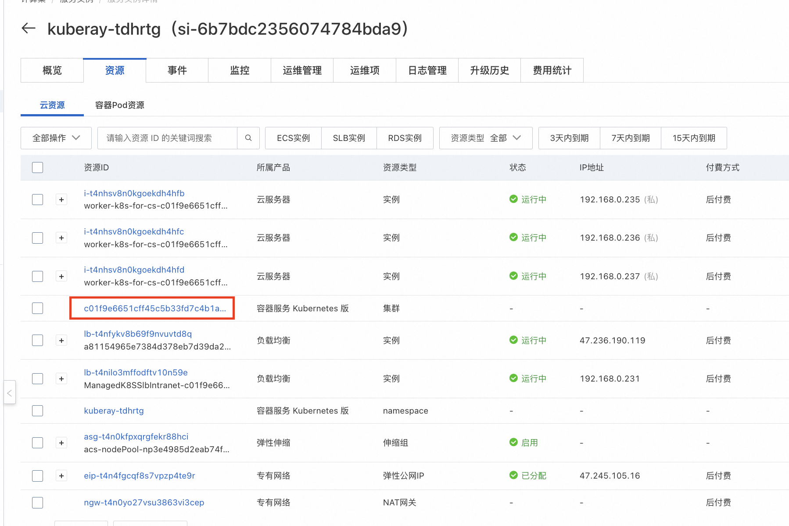
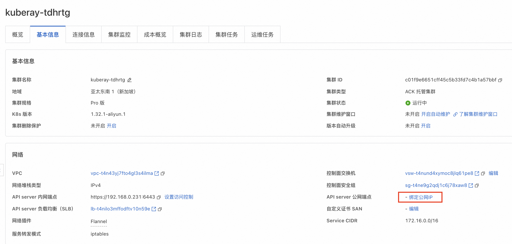
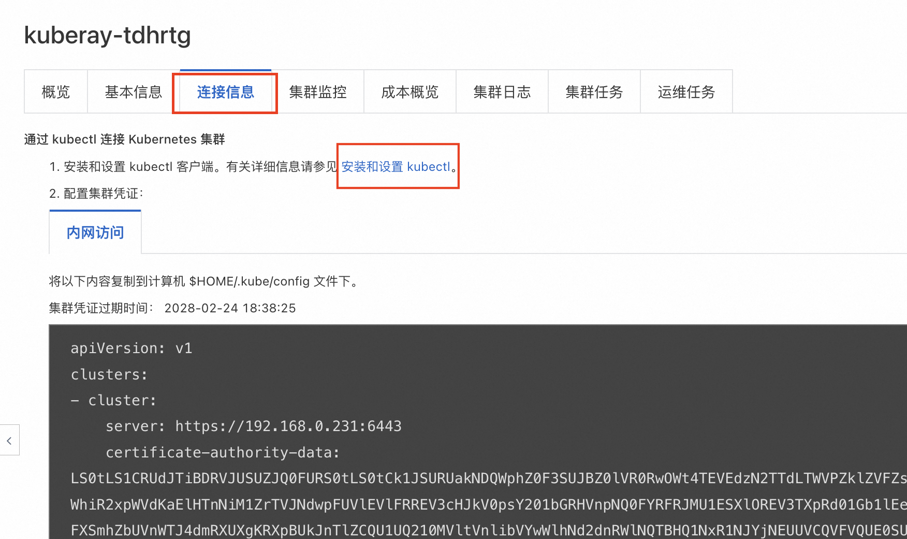
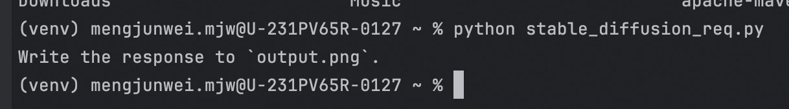

# Ray 计算巢快速部署


>**免责声明：**本服务由第三方提供，我们尽力确保其安全性、准确性和可靠性，但无法保证其完全免于故障、中断、错误或攻击。因此，本公司在此声明：对于本服务的内容、准确性、完整性、可靠性、适用性以及及时性不作任何陈述、保证或承诺，不对您使用本服务所产生的任何直接或间接的损失或损害承担任何责任；对于您通过本服务访问的第三方网站、应用程序、产品和服务，不对其内容、准确性、完整性、可靠性、适用性以及及时性承担任何责任，您应自行承担使用后果产生的风险和责任；对于因您使用本服务而产生的任何损失、损害，包括但不限于直接损失、间接损失、利润损失、商誉损失、数据损失或其他经济损失，不承担任何责任，即使本公司事先已被告知可能存在此类损失或损害的可能性；我们保留不时修改本声明的权利，因此请您在使用本服务前定期检查本声明。如果您对本声明或本服务存在任何问题或疑问，请联系我们。

## 概述

Ray 是一个支持模型训练、测试以及部署的开源平台，由加州大学伯克利分校的 RISELab 开发。 它旨在简化大规模机器学习、强化学习和分布式计算任务的开发与部署。
Ray 的设计目标是提供高性能、灵活性和易用性，使开发者能够轻松构建和扩展复杂的分布式应用程序。无论是处理海量数据、训练深度学习模型，还是运行强化学习算法，Ray 都能提供强大的支持。

## 前提条件

部署Ray社区版服务实例，需要对部分阿里云资源进行访问和创建操作。因此您的账号需要包含如下资源的权限。
  **说明**：当您的账号是RAM账号时，才需要添加此权限。

| 权限策略名称                          | 备注                     |
|---------------------------------|------------------------|
| AliyunCSFullAccess              | 管理容器服务（CS）的权限           |
| AliyunECSFullAccess             | 管理云服务器服务（ECS）的权限       |
| AliyunVPCFullAccess             | 管理专有网络（VPC）的权限         |
| AliyunROSFullAccess             | 管理资源编排服务（ROS）的权限       |
| AliyunComputeNestUserFullAccess | 管理计算巢服务（ComputeNest）的用户侧权限 |


## 计费说明

Ray社区版在计算巢部署的费用主要涉及：

- 所选Worker节点的vCPU与内存规格
- 系统盘类型及容量
- 公网带宽

## 部署流程
1. 点击[Ray一键部署](https://computenest.console.aliyun.com/service/instance/create/cn-hangzhou?type=user&ServiceName=Ray%E7%A4%BE%E5%8C%BA%E7%89%88)链接，
   进入创建Ray集群的页面。如没有阿里云账号需要先注册账号哦。
2. 创建Ray集群时，首先选择新建ACK集群。服务实例名称将作为运行Ray平台的命名空间，将在模型服务部署时使用。
   
3. 为保障Ray的流畅运行，Worker节点建议选择 8vCpu 16GiB 以上的规格。然后填写实例密码。
   
   模型部署基本都有Gpu需求，如果需要Gpu，请在此步选择有Gpu的规格。
   本文档在下一节演示了如何在Ray集群上部署Stable Diffusion模型服务，推荐使用ecs.gn7i-c8g1.2xlarge及以上规格，worker节点系统盘大小推荐1024GB以上。
   
4. 选择任意一个可用区，然后点击 下一步：确认订单。
   
5. 确认依赖权限已授权，如未授权，请点击授权。然后点击 立即创建
   
6. 点击 去列表查看
   
7. 跳转到计算巢控制台的服务实例界面后，请等待Ray集群创建完成，大约需要10分钟。
   
8. 创建Ray集群完成后，点击 Ray集群名称进入Ray集群详情页面。
   
9. 点击透出的web url，即可访问到Ray集群的Ray Dashboard。此时Ray集群已经成功运行，可通过 下一节：快速体验模型部署 了解如何在集群内部署自己的模型。
   
   

## 体验模型服务部署
通过阿里云创建Ray集群后，本节展示如何在Ray集群上部署一个基于 Stable Diffusion 的文本到图像生成服务。更多示例可参考[http://docs.ray.io/en/master/cluster/kubernetes/examples/stable-diffusion-rayservice.html#kuberay-stable-diffusion-rayservice-example)。

### 确认集群配置足够
>**⚠️注意：** 如果集群配置不够用，会导致Stable Diffusion模型服务部署失败。
1. 在Ray集群上部署Stable Diffusion模型服务，推荐使用ecs.gn7i-c8g1.2xlarge及以上规格，worker节点系统盘大小推荐1024GB以上。官方配置要求如下图。
   
   

### 集群绑定公网IP(如果已绑定可跳过)
>**⚠️注意：** 如果不绑定公网IP，会导致Ray集群拉取模型文件失败，也会导致Ray集群无法提供对外服务。
1. 在服务实例详情页面，点击 资源 ，查看Ray集群的资源使用情况。
   
2. 找到k8s集群，点击名称进入k8s集群详情页面。
   
   
3. 点击 绑定公网IP ，选择已有EIP。如果没有EIP，点击创建EIP，创建完成后，返回该页面绑定公网IP。
   
   
### 通过 kubectl 连接 Kubernetes 集群
1. 在服务实例详情页面，点击 资源 ，查看Ray集群的资源使用情况。
   
2. 找到k8s集群，点击名称进入k8s集群详情页面。
   
   
3. 点击连接信息，查看kubeconfig文件。
   
4. 点击 [安装和设置 kubectl](https://kubernetes.io/docs/tasks/tools/?spm=5176.28197681.0.0.5f425ff66rLatZ) 。这是一个用本地设备管理k8s集群的工具。可根据自身操作系统选择对应的安装方式。
   
   
5. 在本地设备上执行以下命令或自行在目录路径下手动创建$HOME/.kube/config文件，并将kubeconfig文件内容粘贴到该文件中。
    ```bash
   sudo mkdir -p $HOME/.kube
   sudo touch $HOME/.kube/config
   sudo chmod 777 $HOME/.kube/config
   vim $HOME/.kube/config
### 部署模型服务
1. 将kubeconfig文件内容粘贴到该文件中后，在本地设备上执行以下命令。--namespace={$服务实例名称}，需要替换为Ray集群名称。
   如笔者的Ray集群名称为kuberay-tdhrtg，因此下面的指令替换为sudo kubectl config set-context --current --namespace=kuberay-tdhrtg
   ```bash
   sudo kubectl config set-context --current --namespace={$Ray集群名称}
   
2. 在本地依次执行以下命令。对应[Ray官方教程](https://docs.ray.io/en/master/cluster/kubernetes/examples/stable-diffusion-rayservice.html)从Step 3之后的部分。
   ```bash
   kubectl apply -f https://raw.githubusercontent.com/ray-project/kuberay/master/ray-operator/config/samples/ray-service.stable-diffusion.yaml
   kubectl get pods
   # Wait until the RayService `Ready` condition is `True`. This means the RayService is ready to serve.
   kubectl describe rayservices.ray.io stable-diffusion
   # Forward the port of Serve
   kubectl port-forward svc/stable-diffusion-serve-svc 8000
   
   # Download `stable_diffusion_req.py`
   curl -LO https://raw.githubusercontent.com/ray-project/serve_config_examples/master/stable_diffusion/stable_diffusion_req.py
   
   # Set your `prompt` in `stable_diffusion_req.py`.

   # Send a request to the Stable Diffusion model.
   python stable_diffusion_req.py
3. 运行python stable_diffusion_req.py后，模型会输出一张名为output.png的图片。此时，Stable Diffusion模型服务部署完成。
   
   
4. output.png如下图所示。
   

---

## 更多信息
1. [Ray官网](https://www.ray.io/)
2. [Ray单机版开源库](https://github.com/ray-project/ray)
3. [Ray集群版开源库](https://github.com/ray-project/kuberay)
4. [Ray QuickStart帮助文档](https://docs.ray.io/en/latest/ray-overview/getting-started.html)
5. [Ray 模型服务化示例文档](https://docs.ray.io/en/latest/ray-overview/examples.html)